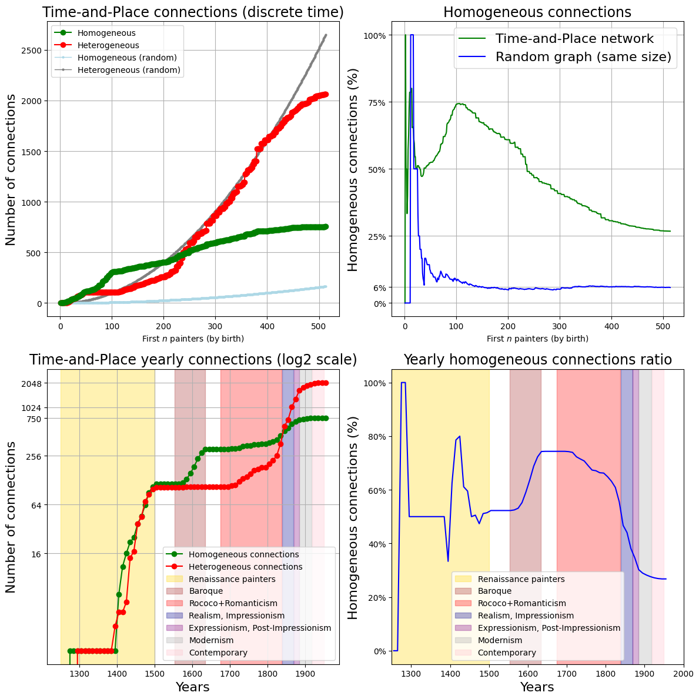
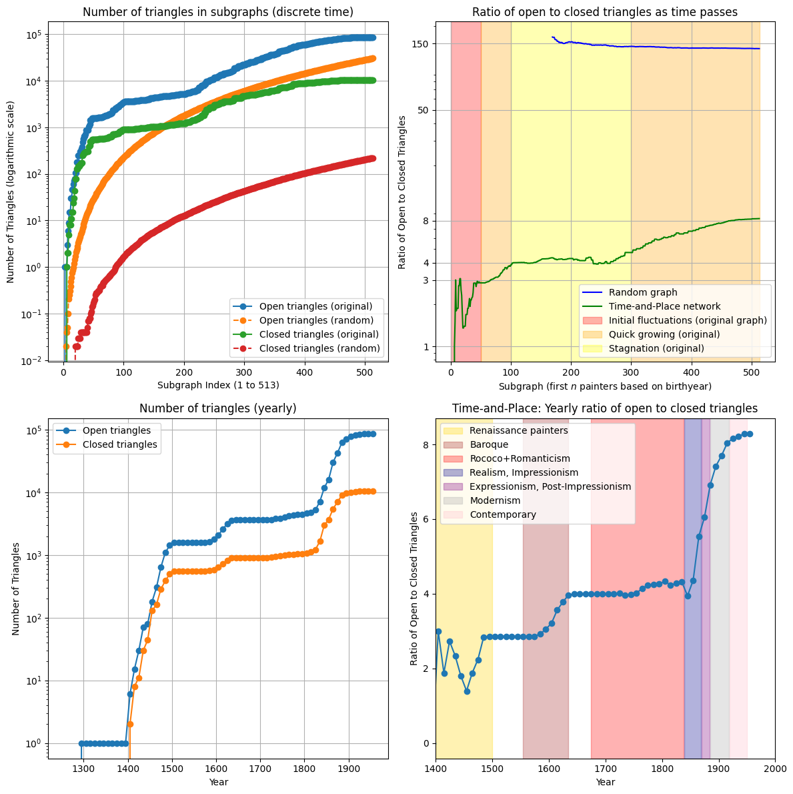
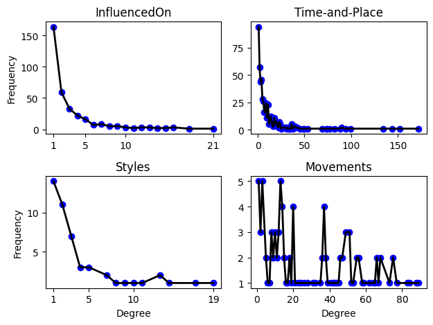
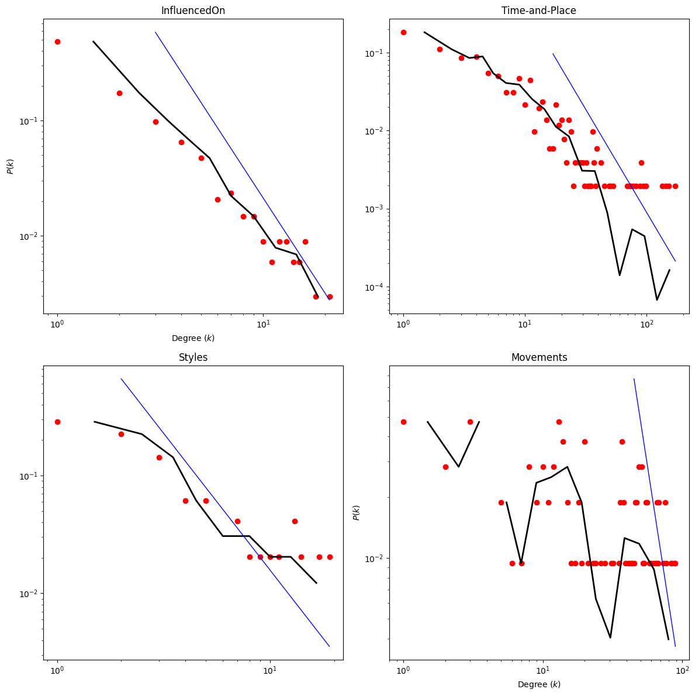
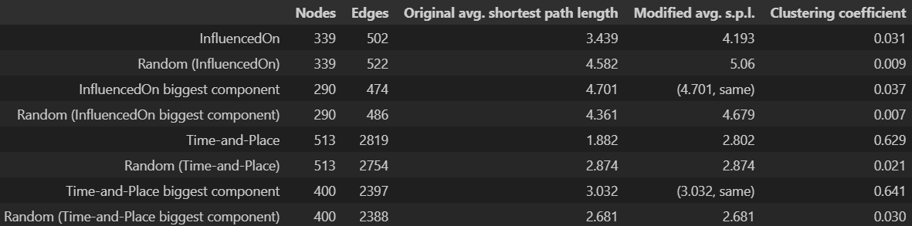
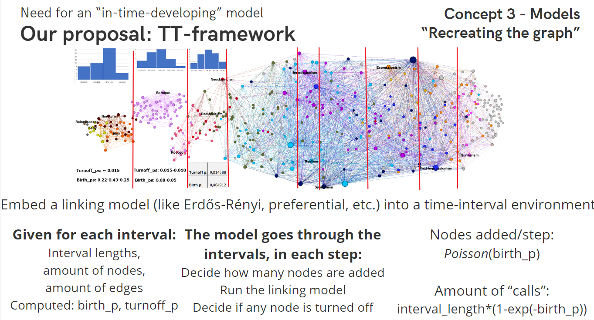
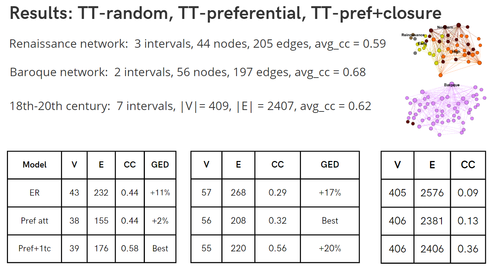

<div class="cell markdown">

# Networks of Painters: Creating links between painters, styles, and art movements based on the PainterPalette dataset

<div align="center">
  
</div>
<hr>
This project aims to understand the connections between painters and art styles. Originally, this included creating a painter dataset, but this evolved into a seperate project called [PainterPalette](https://github.com/me9hanics/PainterPalette). These notebooks use the PainterPalette dataset, creating links between painters based on similarity of style, geographical and social interaction, and also connections between styles and movements.

There have been multiple networks created by us of painters (based on being at the same places at the same time+nationality, additionally style similarity, or who influenced whom networks). We also created a network of styles and movements.

Some visualizations of the resulting networks:


This was turned into a dynamic network and time passes along the horizontal axis, painters are aligned according to their birth year. This network was built by creating connections between painters if they painted at the same places roughly at the same time, filtering just for strong connections.


* Movement network:<br>
<div align="center">
  
</div>

* InfluencedOn network:<br>
<div align="center">
  
</div>

* A map of most common styles in the dataset in different countries:<br>
<div align="center">
  
</div>

[comment]: <> (* 3D plot of painters-styles-movements:<br><div align="center"></div>)


* Time-and-place network:<br>
<div align="center">
  
</div>

* Time-and-place network without reordering nodes based on time (older version):<br>
<div align="center">
  
</div>

(One can see the clusters of movements despite not connecting painters based on style similarities.)

# Dataset:

We created our own dataset called Painter Palette: a dataset with ~3200 painters (Art500k data on 10000 painters), data on their styles, movements, nationality, birthyear, first and last year of painting in the Art500k dataset, birthplace, places of their paintings, influences, friends and coworkers, teachers. It's created by assembling data from paintings from the Art500k dataset, and data from paintings from the WikiArt dataset, with some manual additions. This dataset is available in the [PainterPalette](https://github.com/me9hanics/PainterPalette) repository.

</div>

```python
import pandas as pd

url = "https://raw.githubusercontent.com/me9hanics/PainterPalette/main/datasets/artists.csv"
artists = pd.read_csv(url)
artists
```

The artists.csv file contains all information about painters, each row representing a painter, columns representing an attribute. An example of a few painters from the dataset:

<div class="output execute_result">

| ID | artist | Nationality | citizenship | gender | styles | movement | Art500k_Movements | birth_place | death_place | birth_year | death_year | FirstYear | LastYear | wikiart_pictures_count | locations | locations_with_years | styles_extended | StylesCount | StylesYears | occupations | PaintingsExhibitedAt | PaintingsExhibitedAtCount | PaintingSchool | Influencedby | Influencedon | Pupils | Teachers | FriendsandCoworkers | Contemporary |
|----|--------|-------------|-------------|--------|--------|----------|-------------------|-------------|-------------|------------|------------|-----------|----------|------------------------|-----------|----------------------|-----------------|-------------|-------------|-------------|---------------------|---------------------------|----------------|--------------|--------------|--------|----------|---------------------|---------------|
| 0 | Richard Pousette-Dart | American | United States of America | male | Abstract Art, Abstract Expressionism, Academicism | Abstract Art | {Abstract Expressionism:54} | Saint Paul | Rockland County | 1916.0 | 1992.0 | 1930.0 | 1992.0 | 54.0 | [] | [] | {Abstract Art:10},{Abstract Expressionism:43},{Academicism:1} | {Abstract Expressionism:43}, {Abstract Art:11}, {Academicism:1} | Abstract Expressionism:1940-1992,Abstract Art:1930-1992,Academicism:1944-1944 | photographer, painter, drawer | NY, New York City, US | {New York City:2},{NY:2},{US:2} | New York School,Irascibles | NaN | NaN | NaN | NaN | NaN | NaN |
| 1 | Ethel Léontine Gabain | French,British | United Kingdom | female | Neo-Romanticism | Neo-Romanticism | NaN | Le Havre | London | 1883.0 | 1950.0 | 1930.0 | 1944.0 | 45.0 | [] | [] | {Neo-Romanticism:45} | NaN | NaN | lithographer, painter | London, Manchester, UK | {London:2},{UK:3},{Manchester:1} | NaN | NaN | NaN | NaN | NaN | NaN | No |
| 2 | Charles-Amable Lenoir | NaN | France | male | Academicism, Unknown | Academic Art | {Academic Art:9} | Châtelaillon-Plage | Paris | 1860.0 | 1926.0 | NaN | NaN | 9.0 | [] | [] | {Academicism:1},{Unknown:8} | {Academicism:1} | NaN | painter | NaN | NaN | NaN | NaN | NaN | NaN |
| 3 | Francisco de Zurbaran | Spanish | Spain | male | Baroque, Unknown | Baroque | {Baroque:96} | Fuente de Cantos | Madrid | 1598.0 | 1664.0 | 1625.0 | 1664.0 | 154.0 | ['Seville', 'Madrid'] | ['Seville:1614-1658', 'Madrid:1658-1664'] | {Baroque:150},{Unknown:4} | {Baroque:94} | Baroque:1625-1664 | painter | Hungary, Museo del Prado, Paris, Barcelona, Budapest,Seville, Moscow, Pasadena, London, Sweden, France, Hartford, Grenoble, Munich, CA, Nationalmuseum, ... | {Grenoble:7},{France:19},{Seville:31},{Spain:36},{Bordeaux:1},{Besançon:1},{Barcelona:1},{Paris:4},{Budapest:3},{Hungary:3},{Saint Petersburg:1},{Russia:2},{Museo del Prado:14},{Madrid:19}, ... | NaN | Caravaggio | Gustave Courbet | NaN | Francisco Pacheco | NaN | No |
| 4 | Pieter van Hanselaere | Belgian | Belgium | male | Neoclassicism | Neoclassicism | {Neoclassicism:8} | Ghent | Ghent | 1786.0 | 1862.0 | 1817.0 | 1827.0 | 8.0 | ['Paris', 'Ghent', 'Italy'] | ['Paris:1809-1815,1812-1812', 'Italy:1815-1815'] | {Neoclassicism:8} | {Neoclassicism:8} | Neoclassicism:1817-1827 | painter | Netherlands, Amsterdam | {Amsterdam:2},{Netherlands:2} | NaN | NaN | NaN | NaN | Jacques-Louis David | NaN | No |
| 5 | Jean-Honore Fragonard | French | France | male | Rococo, Unknown | Rococo | {Rococo:72},{Renaissance:1} | Grasse | Paris | 1732.0 | 1806.0 | 1750.0 | 1790.0 | 69.0 | ['Vienna', 'Tivoli', 'Rome', 'Paris', 'Naples', 'Strasburg', 'Grasse', 'Prague', 'Dresden', 'Frankfurt'] | [] | {Rococo:64},{Unknown:5} | {Rococo:70} | Rococo:1750-1790 | illustrator, painter, printmaker, architectural draftsperson, drawer | Netherlands, Paris,London, Pasadena, Moscow, NY, Washington DC, France, Marseille, Munich, CA, Germany, New York City, MA, UK, Toledo, Madrid, OH, Rotterdam, ... | {France:21},{Paris:8},{Moscow:1},{Russia:3},{Saint Petersburg:2},{Washington DC:2},{US:9},{New York City:2},{NY:2},{Rotterdam:1},{Netherlands:1},{Toledo:1},{OH:1},{Munich:1},{Germany:1},{Williamstown:1},... | NaN | NaN | NaN | NaN | NaN | NaN | No |
| 6 | Ion Theodorescu-Sion | Romanian | Romania | male | Art Nouveau (Modern), Impressionism, Post-Impressionism, Symbolism | Post-Impressionism | {Post-Impressionism:43} | Ianca | Bucharest | 1882.0 | 1939.0 | 1909.0 | 1938.0 | 43.0 | [] | [] | {Art Nouveau (Modern):1},{Impressionism:8},{Post-Impressionism:33},{Symbolism:1} | {Post-Impressionism:33}, {Impressionism:8}, {Cubism:2}, {Art Nouveau (Modern):1}, {Symbolism:1} | Post-Impressionism:1912-1938,Impressionism:1913-1934,Cubism:1925-1936,Art Nouveau (Modern):1925-1925,Symbolism:1909-1909 | trade unionist, caricaturist, painter | NaN | NaN | Balchik School | NaN | NaN | NaN | NaN | NaN | No |
| 7 | Janos Mattis-Teutsch | Hungarian,Romanian | Romania | male | Abstract Art, Constructivism, Cubism, Expressionism, Fauvism, Socialist Realism | Constructivism | {Art Nouveau:1},{Socialist realism:1},{Abstract art:1},{Modern art:1},{Constructivism:109} | Brașov | Brașov | 1884.0 | 1960.0 | 1909.0 | 1947.0 | 108.0 | [] | [] | {Abstract Art:59},{Constructivism:7},{Cubism:4},{Expressionism:2},{Fauvism:31},{Socialist Realism:5} | {Constructivism:11}, {Abstract Art:61}, {Expressionism:2}, {Cubism:4}, {Fauvism:31}, {Socialist Realism:5} | Constructivism:1925-1930,Abstract Art:1918-1925,Expressionism:1947-1947,Cubism:1926-1928,Fauvism:1909-1947,Socialist Realism:1928-1945 | writer, poet, painter, sculptor, journalist | NaN | NaN | NaN | NaN | NaN | NaN | NaN | NaN | NaN |
| ... | ... | ... | ... | ... | ... | ... | ... | ... | ... | ... | ... | ... | ... | ... | ... | ... | ... | ... | ... | ... | ... | ... | ... | ... | ... | ... | ... | ... | ... | ... | ... |

</div>

## Analysis:

From the data, we created networks of painters, styles, and movements. The types of networks we created are:

-*style networks*: Nodes are styles, two styles are connected if a painter painted in both styles, at least *n* times (usually *n=150*, the painters who have painted in both styles multiple times are counted multiple times) <br>
-*movement networks*: two movements have a link if there are two paintings with the same style, but from different movements (same exact idea as previously, threshold at 100)<br>
-*painter networks*: Painter influence network from the InfluencedOn data (“pre-defined”, an edge between two artists is created if in the Art500k dataset there was any info on one artist inspiring another on a painting), and a time-and-place network (which is dynamic in a sense) where two painters share a connection roughly if they were at the same place(s) around the same time(s). The reason why these two attributes were considered, and style not, is because these three are the major factors in what connections (network) an artist has, but if we were to analyze stylistic connections then the network would be biased (higher percentage of links between same style/movement painters).

<div class="cell markdown">

## Further details/description:

**Description:** The work in this repository is strongly connected to the painter data collection project [PainterPalette](https://github.com/me9hanics/PainterPalette) observing the properties and structures of painter, style and movement networks. The project includes gathering, preprocessing the data, possibly the hardest task (and not perfected, further work is to exclude less painters while combining datasets), creating various types of networks from certain attributes of the data (both static and dynamic), and analyzing the networks. Some of the analysis is dynamical analysis, and a dynamic model building framework was also created to construct some models for the dynamic analysis (see [here](https://github.com/me9hanics/ArtProject/blob/main/networks/tt-embedded_analysis.ipynb)). We have information on ~3200 (more painters with Art500k data only) painters from the 13th century to the 20th, where they were born, where and when they painted, how many artworks they painted per style, what movement they belonged to, a list of some of the painters who influenced them, who they influenced, the school they studied at and friends and coworkers (not all information is available for all painters, but most information is available for most painters). In this particular work, I wanted to gain more information about the structural properties and statistics of art style, movement, and painter networks. <br>
For this, I created three types of networks to analyze: style, movement, and painter networks.

<details><summary><u>Further details</u></summary>
The results we wished to get from this analysis are that we understand more about the structure of these networks, what type of common properties they have, and how the Time-and-Place network develops over time. A longer term goal would be to know enough of the "driving factors" of this network to be able to create a model that can generate networks with similar properties, and of course, to extend it to more authors, and creating more "sure" connections.

<u> **Important:**</u> We have not included the data preprocessing here, just the creation of networks, as this file is only meant to contain analysis. Getting and preparing data was also a complex and lengthy task, as there was no extensive painter dataset available we had to create our own data from paintings datasets, such as WikiArt, Art500k, and some Wikipedia fetching+manual corrections. The data gathering and preprocessing can be found on GitHub under [me9hanics/PainterPalette](https://github.com/me9hanics/PainterPalette). All analysis including this and others can be found on GitHub under [me9hanics/ArtProject](https://github.com/me9hanics/ArtProject/), this includes analysis that was done with GePhi too (and some basic with Excel).

<u> **Update:**</u> The dataset combination method is now more complete, with more artists, therefore the analysis will be re-run and updated here.

<u> **Note:**</u> The difference between "style" and "movement" is that style is an attribute of a painting, while movement is an attribute of a painter (well, that's one way to look at it, and in our dataset, each painter is only connected to one movement). A painter can paint in multiple styles, but belongs to only one movement, here we store the styles a painter painted in with the number of paintings he painted in that style.

I used Pandas+Numpy for storing and manipulating the data, NetworkX for creating and analyzing the networks, Matplotlib(+ some Seaborn) for plots. I also tried using igraph and graph-tool, but for Windows reasons I found NetworkX to be the most convenient.
</details>

</div>

## Results:

<div align='center'>
          
</div>

**<u>*TL;DR:*</u>**<br>
**Newer styles have more common artists, but they are less strongly connected. New artists explore more styles.** Similarly, new movements are connected to more styles, but more loosely. The **painter networks are (<span style="color:red">small world</span>) and** seem to have a **(<span style="color:red">scale-free</span>)** property, even when looked at a large time period (600+ years). Naively building style and movement networks upon painters start to lose the scale-free property, the degree distribution is ruined by convoluted Poisson distributions (unless one creates higher level networks cleverly, see [Villegas 2023: Laplacian renormalization group](https://www.nature.com/articles/s41567-022-01866-8)), they tend to be small-world only after thresholding to a sparse network. **Artists both move to cities representative of their style (<span style="color:red">Homophily</span>), and are influenced by where they live/work (<span style="color:red">Social Contagion</span>)**.<br>
Dynamically, we created a framework to modify linking methods to include a probabilistic time-interval component (each node can only gain new edges till it "dies"), from which we found that whilst triangular closure helps generating a network having a clustering coefficient closer to the real one, it approximately creates a less accurate network than a simple preferential attachment model. (Both methods outperform Erdős-Rényi, but the preferential attachment model seems to give a closer result the preferential attachment model with triangular closure.)


All in all, we can say that homogeneous movement connections, and similarly, "friend of friend" connections were much more prominent in the first few centuries, when there were only few types of movements in the dataset (gothic, renaissance (early, high, northern), baroque), the percentages of these ratios were high and even in the 18th century, the decrease was slow. However, from the 1800s, especially in the time interval 1850-1950 (the last 10 decades of the dataset), the ratios decreased very fast, the closed triangles ratio fell to around 12.5% and homogeneous connections now do not even make up 30% of all connections. This is likely caused by two things. One being the increase of international connections, as observed in the data that painters have more locations (visited more places, more distant places). Probably the deeper cause of this is the development in transport and transportation infrastructure. The other cause is the large increase in number of styles, even during one period, at any place. Probably the two events helped "develop" the other, painters being familiar with more styles as they travel, and more styles meant painters exploring more styles, likely causing an increase in growth of connections with painters in multiple styles, even international connections being made. These events helped the increase of inter-movement connections. <br>
As for comparison to random graphs, we see that there is much more "organization", through all periods there are more triangles (& clusters) and more homogeneous connections than in random graphs. The next step would be to find what really drives this network's structure (how links are being made), and how to model it.

Since the networks seems to be scale-free, we could think it's driven by preferential attachment, but since preferential attachment linking does not create hubs, we may also think that some triangular closure connections are also driving the network. I'd assume this to be true, but from further analysis done, where I created a framework for linking models (Erdős-Rényi, preferential attachment, pref. attachment with 1 triangle closed each time) to only develop connections between nodes in a certain "time interval" in dynamic networks, and just from "dummy" analysis it seems that even if preferential attachment does not create enough triangles, a simple preferential model creates some better results. See [notebook with slides](https://github.com/me9hanics/ArtProject/blob/main/networks/tt-embedded_analysis.ipynb) and [report](https://github.com/me9hanics/ArtProject/blob/main/CSS%20analysis.pdf). 

## Other possible networks for curious researchers:

Linking painters/people/entities together:<br>
**PageRank / Wiki Connections**

Wiki Connections: partial dataset
<http://www.iesl.cs.umass.edu/data/data-wiki-links><br>
smaller dataset: <https://snap.stanford.edu/data/wikispeedia.html>


### Philosophy


**Philosopher's web**: Only available after paying 10$ for pro user<br>
**Philosophy NLP data**: https://philosophydata.com/phil_nlp.zip


### Six Degrees of Francis Bacon

Network of the people connected to Francis Bacon, the network contains mostly born in the 16th century and are English so most
philosophers in this list are not super relevant, there is no Kant,
Nietzsche, etc. But a good example with a great visualization.

<http://www.sixdegreesoffrancisbacon.com/?ids=10000473&min_confidence=60&type=network>

<details><summary><u>Code for obtaining graph</u></summary>
<p>
    
```python
import igraph as ig #To install: conda install -c conda-forge python-igraph  
people = pd.read_csv('datasets/SDFB_people_.csv')
relationships = pd.read_csv('datasets/SDFB_relationships_.csv')

#I used igraph, because it's faster than networkx, and graph-tool sucks on Windows
network = relationships.rename(columns={'id': 'relationship_id', }).drop(columns=['created_by', 'approved_by', 'citation'])
print(network.head(), '\n')
cols = network.columns.tolist()
cols = cols[1:3] + cols[0:1] + cols[3:]
network = network[cols]
network = network[network['person1_index'] != 10050190] #for some reason, there is no person with this id, I did a loop
# I used the documentation here: https://python.igraph.org/en/stable/generation.html#from-pandas-dataframe-s  this I followed
# this is important too: https://python.igraph.org/en/stable/api/igraph.Graph.html#DataFrame  
g = ig.Graph.DataFrame(network, directed=False, vertices=people[['id', 'display_name','historical_significance','birth_year','death_year']], use_vids=False)
print(g.summary().replace(',', '\n'))
```
    
</p>
</details>
<details><summary><u>Code for filtering</u></summary>
<p>
    
```python
filtered = g.vs.select(_degree = 0) #https://python.igraph.org/en/stable/tutorial.html#selecting-vertices-and-edges
g.delete_vertices(filtered)

import cairo #Needed for plotting #import cairocffi as cairo  # can do matplotlib too
#layout = g.layout(layout='auto')
#ig.plot(g, layout = layout) #ig.plot(g) #looks even worse

```
    
</p>
</details>
<details><summary><u>Code for obtaining graph</u></summary>
<p>
    
```python
layout = g.layout(layout='reingold_tilford_circular') #kamada_kawai requires too much computing, 'fruchterman_reingold' is too dense
visual_style = {}
visual_style["vertex_size"] = 5
visual_style["vertex_color"] = "blue"
visual_style['bbox'] = (900, 900)
visual_style["layout"] = layout
#ig.plot(g, **visual_style) #Commented out because it takes big memory
# Needs improvement, but it's a start
```
    
</p>
</details>

### Health:

<https://global.health/> they got nice data on diseases, probably
time-variant too, such as monkeypox, ebola.
    
Modeling of Biological + Socio-tech systems (MOBS) Lab: <https://www.mobs-lab.org/>


