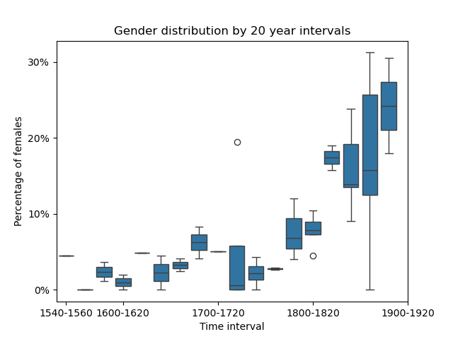

# ArtProject
**Large scale painter network analysis:<br>Creating and analyzing networks of painters, styles, and art movements, based on the PainterPalette dataset**

<div align="center">
  
  
  
</div>

## **NetSci 2025**

If you've come here from the NetSci 2025 conference slides, thank you for attending! Here are links to the works:

- [PainterPalette](https://github.com/me9hanics/PainterPalette?tab=readme-ov-file#painterpalette) dataset of 10000 painters (.csv file), download `csv/Excel/SQL` [here](https://github.com/me9hanics/PainterPalette/releases/tag/v1.0.3)
- Network of 3000 painters: Download `graphml` file from the same [link](https://github.com/me9hanics/PainterPalette/releases/tag/v1.0.3).
  - The implementation of creating the network based on approximating which pair of artists likely lived at the same place at the same time (for long enough), is available in the [painter-network-exploration](https://github.com/me9hanics/painter-network-exploration?tab=readme-ov-file#painter-network-exploration) repository.
- [Using Wikidata to gather extensive information](https://github.com/me9hanics/wikidata-SparQL-data-collection) about historical people
- [NetSci 2025 presentation](https://me9hanics.github.io/projects/NetSci2025_PainterNetwork.pptx)
- [Coexhibition network of artists](https://github.com/me9hanics/e-flux_scraping_coexhibition_networks?tab=readme-ov-file#coexhibition-network) from web scraped e-flux.com data and PainterPalette - explainging the solution in great depth
- Collection of art analyses I was involved in [ArtProject](https://github.com/me9hanics/ArtProject)
- A [SQL script](https://github.com/me9hanics/paintings-SQL-data-warehouse?tab=readme-ov-file#painters-paintings-institutions-and-styles-an-sql-database-with-an-etl-pipeline-and-analytics) creating a database of painters, paintings, styles, movements and institutions (outdated)
- Graph database: [Neo4j painter coexhibition network storing](https://github.com/me9hanics/Neo4j-KNIME-coexhibition-network-pipeline?tab=readme-ov-file#painter-coexhibition-network-creation-and-analytics-using-neo4j-and-knime) and analysis, based on a pipeline designed in KNIME
- [Website](https://me9hanics.github.io/projects/painterpalette.html) under construction 

For any questions on how you could take ideas and use them in your project, just contact me on my personal e-mail.

## Description

<br> This project studies the connections between painters on large networks, and between art styles. As of 2025, it is a collection of different works (across multiple repositories of mine), each analyzing painter networks, alongside this repository with analysis of movements and styles; and outdated painter network analysis (for an updated version, see the [painter-network-exploration](https://github.com/me9hanics/painter-network-exploration?tab=readme-ov-file#painter-network-exploration) repository.)<br>
Originally, this work included creating the painter dataset for the analysis, but that evolved into a seperate project called [PainterPalette](https://github.com/me9hanics/PainterPalette) that has already collected extensive data of 10000 painters with ~30 attributes of various categories: <br>
- biography data such as nationality, citizenship, gender, birth and death places and dates,<br>
- artistic style data (e.g. number of paintings per style for a painter) with quantities,<br>
- locations of activity with years, list of occupations,<br>
- social network (teachers and pupils, some friends and coworkers, influences), painting school affiliations.

This work uses the above mentioned PainterPalette dataset.

The freshest analysis runs on painter networks, either created by connecting painters living at the same places at the same time, or by coexhibitions. The analysis includes:

- Macroscopic painter network analysis: 
  - degree distribution(s), clustering coefficients
  - centrality measures, and why they do not work on this longitudinal network
  - assortativity, rich-club coefficients
  - painter attribute statistics (e.g. percentage of movements and nationalities), attribute-attribute relationships
- Mesoscopic painter network analysis: Community detection, community and community-attribute statistics
- Dynamic painter network development analysis: development of styles throughout the development of time, dynamic clustering coefficient, dynamic heterogeneous and homogeneous connections (and models for dynamic network development)
- Style and movement analysis: statistics, co-painter network of styles and co-style network of movements, most central styles and movements

The latest work is under the [painter-network-exploration](https://github.com/me9hanics/painter-network-exploration?tab=readme-ov-file#painter-network-exploration) repository, on a time-and-place connected painter network, containing all but the last two types of analysis mentioned above.<br>
Older analysis in this repository includes style and movement measures, dynamic network analysis and outdated results of painter network statistics. 

Construction of networks can be found usually in the same notebooks.

If you are looking for a relational dataset of paintings and painters instead, with institutions, styles, and movements, I wrote an SQL script to build a relational database: [Paintings-Painters-SQL](https://github.com/me9hanics/DataEngineering-SQL/blob/main/Term1/operational_layer_data_processing.sql) (change the file paths and download the data in the datasets folder). A KNIME pipeline for creating a coexhibition network and seemlessly periodically loading it into a Neo4j database is also available [in this subrepo](https://github.com/me9hanics/DataEngineering-SQL/tree/main/Term2#painter-coexhibition-network-creation-and-analytics-using-neo4j-and-knime) along with data and presentation slides.

### Edge strength measure

$$ TLSI = \frac{{\text{{common years (in their lifetime)}}}}{{\text{{amount of places}}}} \times \text{{amount of common places}} $$


### *Networks*

Multiple painters networks were created:

- connections based on living at the same places at the same time (& nationality): see the latest work <br>
Another, less extensive example in this repository: [painters_network_connected_by_locations.ipynb](https://github.com/me9hanics/ArtProject/blob/main/analysis/painters_network_connected_by_locations.ipynb)<br>
Older "premature" analyses, that focuses on dynamic network development: [triangle_closure_cultural_dynamics.ipynb](https://github.com/me9hanics/ArtProject/blob/main/old%20analysis%20(2023)/networks/triangle_closure_cultural_dynamics.ipynb) and [tt-embedded_analysis.ipynb](https://github.com/me9hanics/ArtProject/blob/main/old%20analysis%20(2023)/networks/tt-embedded_analysis.ipynb) notebooks<br>
- networks using artistic style similarity (and time)
- coexhibition network, using scraped data from the e-flux website, see the separate repo with great technical description: [e-flux_scraping](https://github.com/me9hanics/e-flux_scraping_coexhibition_networks)
- who influenced whom networks (considerably smaller size).

We also created a network of styles and movements.

<br>**Note**: In 2024 March and December, the analyses were repeated, with an updated PainterPalette dataset (more painters, cleaner instances with more attributes) that now includes more painters found explicitly in Art500k. The analysis and the results have been simplified and reorganized. Most work, except dynamic network analysis, has been implemented more professionally in these projects:

- painter network based on living at the same place at the same time (approximately): [https://github.com/me9hanics/painter-network-exploration](https://github.com/me9hanics/painter-network-exploration?tab=readme-ov-file#painter-network-exploration) - the `painter_networks.ipynb` notebook contains the network creation, filtering and analysis: macroscale statistics e.g. degree distributions, assortativity (rich club behaviour), attribute statistics such as female representation and nationalities, and community detection mesoscale analysis. This is the freshest, most complete and most professional analysis.
- painter network based on coexhibitions: [e-flux coexhibition networks](https://github.com/me9hanics/e-flux_scraping_coexhibition_networks/tree/main?tab=readme-ov-file#coexhibition-network) - the repo focuses more on the technical implementation of scraping and network creation, however the [community detection](https://github.com/me9hanics/e-flux_scraping_coexhibition_networks/blob/main/5_community_detection.ipynb) and [association rule mining](https://github.com/me9hanics/e-flux_scraping_coexhibition_networks/blob/main/5_association_rules.ipynb) notebooks contain relevant works.

**The results are mostly available at the [Results section](https://github.com/me9hanics/ArtProject/edit/main/README.md#results), WIP.**

## Some network visualizations:

* Network of movements (connected based on paintings of one style sharing different painter movements), and "InfluencedOn" painter network:<br>
<div align="center">
  
  
</div>

* Communities and hierarchical interconnectedness in a time-and-place connected network:<br>
<div align="center">
  
</div>

<!--
[comment]: <> (* 3D plot of painters-styles-movements:<br><div align="center"></div>)

[comment]: <> (* A map of most common styles in the dataset in different countries:<br> <div align="center"></div>)

[comment]: <> (* Communities and interconnectedness in a time-and-place connected network:<br><div align="center"></div>)
-->

* Time-and-place connection network of painters:<br>
<div align="center">
  
</div>

This was turned into a dynamic network and time passes along the horizontal axis, painters are aligned according to their birth year. This network was built by creating connections between painters if they painted at the same places roughly at the same time, filtering just for strong connections.


## Dataset:

We created our own dataset called Painter Palette: a dataset with ~10000 painters (with Art500k painting data and WikiArt and Wikidata on most painters), data of their styles, movements, nationality, birthyear, first and last year of painting in the Art500k dataset, birthplace, places of their paintings, influences, friends and coworkers, teachers. It's created by assembling data from paintings from the Art500k dataset, and data from paintings from the WikiArt dataset, and some manual additions. This dataset is available in the [PainterPalette](https://github.com/me9hanics/PainterPalette) repository and is occasionally updated. The latest version can easily be imported:

</div>

```python
import pandas as pd

url = "https://raw.githubusercontent.com/me9hanics/PainterPalette/main/datasets/artists.csv"
artists = pd.read_csv(url)
artists
```

The artists.csv file contains all information about painters, each row representing a painter, columns representing an attribute. An example of a few painters from the dataset:

<div class="output execute_result">

| ID | artist | Nationality | citizenship | gender | styles | movement | Art500k_Movements | birth_place | death_place | birth_year | death_year | FirstYear | LastYear | wikiart_pictures_count | locations | locations_with_years | styles_extended | StylesCount | StylesYears | occupations | PaintingsExhibitedAt | PaintingsExhibitedAtCount | PaintingSchool | Influencedby | Influencedon | Pupils | Teachers | FriendsandCoworkers | Contemporary |
|----|--------|-------------|-------------|--------|--------|----------|-------------------|-------------|-------------|------------|------------|-----------|----------|------------------------|-----------|----------------------|-----------------|-------------|-------------|-------------|---------------------|---------------------------|----------------|--------------|--------------|--------|----------|---------------------|---------------|
| 0 | Richard Pousette-Dart | American | United States of America | male | Abstract Art, Abstract Expressionism, Academicism | Abstract Art | {Abstract Expressionism:54} | Saint Paul | Rockland County | 1916.0 | 1992.0 | 1930.0 | 1992.0 | 54.0 | [] | [] | {Abstract Art:10},{Abstract Expressionism:43},{Academicism:1} | {Abstract Expressionism:43}, {Abstract Art:11}, {Academicism:1} | Abstract Expressionism:1940-1992,Abstract Art:1930-1992,Academicism:1944-1944 | photographer, painter, drawer | NY, New York City, US | {New York City:2},{NY:2},{US:2} | New York School,Irascibles | NaN | NaN | NaN | NaN | NaN | NaN |
| 1 | Ethel Léontine Gabain | French,British | United Kingdom | female | Neo-Romanticism | Neo-Romanticism | NaN | Le Havre | London | 1883.0 | 1950.0 | 1930.0 | 1944.0 | 45.0 | [] | [] | {Neo-Romanticism:45} | NaN | NaN | lithographer, painter | London, Manchester, UK | {London:2},{UK:3},{Manchester:1} | NaN | NaN | NaN | NaN | NaN | NaN | No |
| 2 | Charles-Amable Lenoir | NaN | France | male | Academicism, Unknown | Academic Art | {Academic Art:9} | Châtelaillon-Plage | Paris | 1860.0 | 1926.0 | NaN | NaN | 9.0 | [] | [] | {Academicism:1},{Unknown:8} | {Academicism:1} | NaN | painter | NaN | NaN | NaN | NaN | NaN | NaN |
| 3 | Francisco de Zurbaran | Spanish | Spain | male | Baroque, Unknown | Baroque | {Baroque:96} | Fuente de Cantos | Madrid | 1598.0 | 1664.0 | 1625.0 | 1664.0 | 154.0 | ['Seville', 'Madrid'] | ['Seville:1614-1658', 'Madrid:1658-1664'] | {Baroque:150},{Unknown:4} | {Baroque:94} | Baroque:1625-1664 | painter | Hungary, Museo del Prado, Paris, Barcelona, Budapest,Seville, Moscow, Pasadena, ... | {Grenoble:7},{France:19},{Seville:31},{Spain:36},{Bordeaux:1},{Besançon:1},... | NaN | Caravaggio | Gustave Courbet | NaN | Francisco Pacheco | NaN | No |
| 4 | Pieter van Hanselaere | Belgian | Belgium | male | Neoclassicism | Neoclassicism | {Neoclassicism:8} | Ghent | Ghent | 1786.0 | 1862.0 | 1817.0 | 1827.0 | 8.0 | ['Paris', 'Ghent', 'Italy'] | ['Paris:1809-1815,1812-1812', 'Italy:1815-1815'] | {Neoclassicism:8} | {Neoclassicism:8} | Neoclassicism:1817-1827 | painter | Netherlands, Amsterdam | {Amsterdam:2},{Netherlands:2} | NaN | NaN | NaN | NaN | Jacques-Louis David | NaN | No |
| 5 | Jean-Honore Fragonard | French | France | male | Rococo, Unknown | Rococo | {Rococo:72},{Renaissance:1} | Grasse | Paris | 1732.0 | 1806.0 | 1750.0 | 1790.0 | 69.0 | ['Vienna', 'Tivoli', 'Rome', 'Paris', 'Strasburg', 'Grasse', ...] | [] | {Rococo:64},{Unknown:5} | {Rococo:70} | Rococo:1750-1790 | illustrator, painter, printmaker, architectural draftsperson, drawer | Netherlands, Paris, London, Pasadena, Toledo, Madrid, Germany, Rotterdam, ... | {France:21},{Paris:8},{Moscow:1},{Russia:3},{Saint Petersburg:2},{Washington DC:2},{US:9},... | NaN | NaN | NaN | NaN | NaN | NaN | No |
| 6 | Ion Theodorescu-Sion | Romanian | Romania | male | Art Nouveau (Modern), Impressionism, Post-Impressionism, Symbolism | Post-Impressionism | {Post-Impressionism:43} | Ianca | Bucharest | 1882.0 | 1939.0 | 1909.0 | 1938.0 | 43.0 | [] | [] | {Art Nouveau (Modern):1},{Impressionism:8},{Post-Impressionism:33},{Symbolism:1} | {Post-Impressionism:33}, {Impressionism:8}, {Cubism:2}, {Art Nouveau (Modern):1}, {Symbolism:1} | Post-Impressionism:1912-1938,Impressionism:1913-1934,Cubism:1925-1936,Art Nouveau (Modern):1925-1925,Symbolism:1909-1909 | trade unionist, caricaturist, painter | NaN | NaN | Balchik School | NaN | NaN | NaN | NaN | NaN | No |
| 7 | Janos Mattis-Teutsch | Hungarian,Romanian | Romania | male | Abstract Art, Constructivism, Cubism, Fauvism, Expressionism, Socialist Realism | Constructivism | {Art Nouveau:1},{Socialist realism:1},{Abstract art:1},{Modern art:1},{Constructivism:109} | Brașov | Brașov | 1884.0 | 1960.0 | 1909.0 | 1947.0 | 108.0 | [] | [] | {Abstract Art:59},{Constructivism:7},{Cubism:4},{Expressionism:2},{Fauvism:31},{Socialist Realism:5} | {Constructivism:11}, {Abstract Art:61}, {Expressionism:2}, {Cubism:4}, {Fauvism:31}, {Socialist Realism:5} | Constructivism:1925-1930,Abstract Art:1918-1925,Expressionism:1947-1947,Cubism:1926-1928,Fauvism:1909-1947,Socialist Realism:1928-1945 | writer, poet, painter, sculptor, journalist | NaN | NaN | NaN | NaN | NaN | NaN | NaN | NaN | NaN |
| ... | ... | ... | ... | ... | ... | ... | ... | ... | ... | ... | ... | ... | ... | ... | ... | ... | ... | ... | ... | ... | ... | ... | ... | ... | ... | ... | ... | ... | ... | ... | ... |

</div>

## Results:

More description: *coming soon*

<br>**Analysis from the *painter-network-exploration* repository**:

The network is highly assortative, and omits to rich-club behaviour at high degrees.<br>


Alpha values for power-law fits are rather high: these two plots are for the thresholds at 5 and 20, having alpha values 12 and 5, respectively, much higher than the typical [2,3] range:<br>


When taking a snapshot of this longitudinal network, the power-law fit picks up a more realistic $\alpha=3.6$ value:<br>


*Communities*:

<div align='center'>
  Distribution of females per community (3000 artists), and distribution of females per century (3000 artists):<br>
  
  <br>
</div>


**Previous brief analysis**:

<div align='center'>
  Distribution of females per community (3000 artists), and distribution of females per century (3000 artists):<br>
  
  <br>
</div>

<!--

<div align='center'>
    <br><br>
    Distribution of amount of WikiArt pictures on average per community
</div>
-->

<br>**Old results and dynamic analysis**:

<div align='center'>
          
</div>

In the time-and-place connected painter network, one can see the clusters of movements despite not connecting painters based on style similarities.

**<u>*TL;DR:*</u>**<br>

- Impressionism and realism are the most "central" styles
- There is overall less than 10% of representation of females throughout up until the 20th century, but seeing an increasing trend according to the dataset; American and British painters have a high representation at roughly 15% (the first representing mostly 20th century painters)
- Among nationalities, Russian artists have the highest average picture count on WikiArt, which may mean that among the painters who become famous, Russians have the most notable and survived works. Among communities, a group of French and American late impressionists, French academic art painters, and realists, have the highest average WikiArt picture count.
- Females are most common in a 20th-century community consisting of American and Japanese artists, and the dataset has a high representation of female artists among US artists.
- The complete network is a longitudinal chain of networks, which makes it different from typical social networks in structure. This is because it is a historical network, and entities (artists) can only gain connections in a tight window of the network. The distribution still resembles a power law, however with very high $\alpha$ value. Basic centrality measures in this network are biased. Taking a snapshot of the network at a certain time would give a more typical result for various measures.

*Old analysis results*:

**Newer styles have more common artists, but they are less strongly connected. New artists explore more styles.** Similarly, new movements are connected to more styles, but more loosely. The **painter networks are (<span style="color:red">small world</span>) and** seem to have a **(<span style="color:red">scale-free</span>)** property, even when looked at a large time period (600+ years). Naively building style and movement networks upon painters start to lose the scale-free property, the degree distribution is ruined by convoluted Poisson distributions (unless one creates higher level networks cleverly, see [Villegas 2023: Laplacian renormalization group](https://www.nature.com/articles/s41567-022-01866-8)), they tend to be small-world only after thresholding to a sparse network. **Artists both move to cities representative of their style (<span style="color:red">Homophily</span>), and are influenced by where they live/work (<span style="color:red">Social Contagion</span>)**.<br>
Dynamically, we created a framework to modify linking methods to include a probabilistic time-interval component (each node can only gain new edges till it "dies"), from which we found that whilst triangular closure helps generating a network having a clustering coefficient closer to the real one, it approximately creates a less accurate network than a simple preferential attachment model. (Both methods outperform Erdős-Rényi, but the preferential attachment model seems to give a closer result the preferential attachment model with triangular closure.)


All in all, we can say that homogeneous movement connections, and similarly, "friend of friend" connections were much more prominent in the first few centuries, when there were only few types of movements in the dataset (gothic, renaissance (early, high, northern), baroque), the percentages of these ratios were high and even in the 18th century, the decrease was slow. However, from the 1800s, especially in the time interval 1850-1950 (the last 10 decades of the dataset), the ratios decreased very fast, the closed triangles ratio fell to around 12.5% and homogeneous connections now do not even make up 30% of all connections. This is likely caused by two things. One being the increase of international connections, as observed in the data that painters have more locations (visited more places, more distant places). Probably the deeper cause of this is the development in transport and transportation infrastructure. The other cause is the large increase in number of styles, even during one period, at any place. Probably the two events helped "develop" the other, painters being familiar with more styles as they travel, and more styles meant painters exploring more styles, likely causing an increase in growth of connections with painters in multiple styles, even international connections being made. These events helped the increase of inter-movement connections. <br>
As for comparison to random graphs, we see that there is much more "organization", through all periods there are more triangles (& clusters) and more homogeneous connections than in random graphs. The next step would be to find what really drives this network's structure (how links are being made), and how to model it.

Since the networks seems to be scale-free, we could think it's driven by preferential attachment, but since preferential attachment linking does not create hubs, we may also think that some triangular closure connections are also driving the network. I'd assume this to be true, but from further analysis done, where I created a framework for linking models (Erdős-Rényi, preferential attachment, pref. attachment with 1 triangle closed each time) to only develop connections between nodes in a certain "time interval" in dynamic networks, and just from "dummy" analysis it seems that even if preferential attachment does not create enough triangles, a simple preferential model creates some better results. See [notebook with slides](https://github.com/me9hanics/ArtProject/blob/main/networks/tt-embedded_analysis.ipynb) and [report](https://github.com/me9hanics/ArtProject/blob/main/CSS%20analysis.pdf). 

## Old analysis:

From the data, we created networks of painters, styles, and movements. The types of networks we created are:

-*style networks*: Nodes are styles, two styles are connected if a painter painted in both styles, at least *n* times (usually *n=150*, the painters who have painted in both styles multiple times are counted multiple times) <br>
-*movement networks*: two movements have a link if there are two paintings with the same style, but from different movements (same exact idea as previously, threshold at 100)<br>
-*painter networks*: Painter influence network from the InfluencedOn data (“pre-defined”, an edge between two artists is created if in the Art500k dataset there was any info on one artist inspiring another on a painting), and a time-and-place network (which is dynamic in a sense) where two painters share a connection roughly if they were at the same place(s) around the same time(s). The reason why these two attributes were considered, and style not, is because these three are the major factors in what connections (network) an artist has, but if we were to analyze stylistic connections then the network would be biased (higher percentage of links between same style/movement painters).


### Old analysis further details:

**Description:** The work in this repository contains observing the properties and structures of painter, style and movement networks. The project includes gathering, preprocessing the data, possibly the hardest task (and not perfected, further work is to exclude less painters while combining datasets), creating various types of networks from certain attributes of the data (both static and dynamic), and analyzing the networks. Some of the analysis is dynamical analysis, and a dynamic model building framework was also created to construct some models for the dynamic analysis (see [here](https://github.com/me9hanics/ArtProject/blob/main/networks/tt-embedded_analysis.ipynb)). We have information on ~3200 (more painters with Art500k data only) painters from the 13th century to the 20th, where they were born, where and when they painted, how many artworks they painted per style, what movement they belonged to, a list of some of the painters who influenced them, who they influenced, the school they studied at and friends and coworkers (not all information is available for all painters, but most information is available for most painters). In this particular work, I wanted to gain more information about the structural properties and statistics of art style, movement, and painter networks. <br>
For this, I created three types of networks to analyze: style, movement, and painter networks.

<details><summary><u>Further details</u></summary>
The results we wished to get from this analysis are that we understand more about the structure of these networks, what type of common properties they have, and how the Time-and-Place network develops over time. A longer term goal would be to know enough of the "driving factors" of this network to be able to create a model that can generate networks with similar properties, and of course, to extend it to more authors, and creating more "sure" connections.

<u> **Important:**</u> We have not included the data preprocessing here, just the creation of networks, as this file is only meant to contain analysis. Getting and preparing data was also a complex and lengthy task, as there was no extensive painter dataset available we had to create our own data from paintings datasets, such as WikiArt, Art500k, and some Wikipedia fetching+manual corrections. The data gathering and preprocessing can be found on GitHub under [me9hanics/PainterPalette](https://github.com/me9hanics/PainterPalette). All analysis including this and others can be found on GitHub under [me9hanics/ArtProject](https://github.com/me9hanics/ArtProject/), this includes analysis that was done with GePhi too (and some basic with Excel).

<u> **Update:**</u> The dataset combination method is now more complete, with more artists, therefore the analysis will be re-run and updated here.

<u> **Note:**</u> The difference between "style" and "movement" is that style is an attribute of a painting, while movement is an attribute of a painter (well, that's one way to look at it, and in our dataset, each painter is only connected to one movement). A painter can paint in multiple styles, but belongs to only one movement, here we store the styles a painter painted in with the number of paintings he painted in that style.

I used Pandas+Numpy for storing and manipulating the data, NetworkX for creating and analyzing the networks, Matplotlib(+ some Seaborn) for plots. I also tried using igraph and graph-tool, but for Windows reasons I found NetworkX to be the most convenient.
</details>

## Other possible networks for curious researchers:

If you would like relational dataset of paintings and painters, and institutions, styles, movements, here is a SQL script for it: [Paintings-Painters-SQL](https://github.com/me9hanics/DataEngineering-SQL/blob/main/Term1/operational_layer_data_processing.sql), but change the file paths and download the data in the datasets folder.

Linking painters/people/entities together:<br>
**PageRank / Wiki Connections**

Wiki Connections: partial dataset
<http://www.iesl.cs.umass.edu/data/data-wiki-links><br>
smaller dataset: <https://snap.stanford.edu/data/wikispeedia.html>


### Philosophy


**Philosopher's web**: Only available after paying 10$ for pro user<br>
**Philosophy NLP data**: https://philosophydata.com/phil_nlp.zip


### Six Degrees of Francis Bacon

Network of the people connected to Francis Bacon, the network contains mostly born in the 16th century and are English so most
philosophers in this list are not super relevant, there is no Kant,
Nietzsche, etc. But a good example with a great visualization.

<http://www.sixdegreesoffrancisbacon.com/?ids=10000473&min_confidence=60&type=network>

<details><summary><u>Code for obtaining graph in igraph</u></summary>
<p>
    
```python
import igraph as ig #To install: conda install -c conda-forge python-igraph  
people = pd.read_csv('datasets/SDFB_people_.csv')
relationships = pd.read_csv('datasets/SDFB_relationships_.csv')

#I used igraph, because it's faster than networkx, and graph-tool sucks on Windows
network = relationships.rename(columns={'id': 'relationship_id', }).drop(columns=['created_by', 'approved_by', 'citation'])
print(network.head(), '\n')
cols = network.columns.tolist()
cols = cols[1:3] + cols[0:1] + cols[3:]
network = network[cols]
network = network[network['person1_index'] != 10050190] #for some reason, there is no person with this id, I did a loop
# I used the documentation here: https://python.igraph.org/en/stable/generation.html#from-pandas-dataframe-s  this I followed
# this is important too: https://python.igraph.org/en/stable/api/igraph.Graph.html#DataFrame  
g = ig.Graph.DataFrame(network, directed=False, vertices=people[['id', 'display_name','historical_significance','birth_year','death_year']], use_vids=False)
print(g.summary().replace(',', '\n'))
```
    
</p>
</details>
<details><summary><u>Code for filtering</u></summary>
<p>
    
```python
filtered = g.vs.select(_degree = 0) #https://python.igraph.org/en/stable/tutorial.html#selecting-vertices-and-edges
g.delete_vertices(filtered)

import cairo #Needed for plotting #import cairocffi as cairo  # can do matplotlib too
#layout = g.layout(layout='auto')
#ig.plot(g, layout = layout) #ig.plot(g) #looks even worse

```
    
</p>
</details>
<details><summary><u>Code for obtaining graph</u></summary>
<p>
    
```python
layout = g.layout(layout='reingold_tilford_circular') #kamada_kawai requires too much computing, 'fruchterman_reingold' is too dense
visual_style = {}
visual_style["vertex_size"] = 5
visual_style["vertex_color"] = "blue"
visual_style['bbox'] = (900, 900)
visual_style["layout"] = layout
#ig.plot(g, **visual_style) #takes large memory
# Needs changes, but it's a start
```
    
</p>
</details>

### Health:

<https://global.health/> they got nice data on diseases, probably
time-variant too, such as monkeypox, ebola.
    
Modeling of Biological + Socio-tech systems (MOBS) Lab: <https://www.mobs-lab.org/>

## Contact:

E-mail: on my GitHub profile<br>
Website: me9hanics.github.io (in works)

Mihaly Hanics, Vienna, Austria

